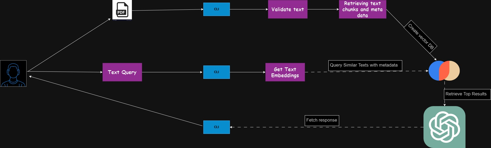

# PDF_TO_CLI_CHATBOT
## Overview

This project implements a console-based AI chatbot leveraging generative AI techniques to provide accurate, informative responses while mitigating hallucinations. The chatbot utilizes external PDF documents and a vector database for enhanced reliability.

Interact with any PDF file from the terminal without using Langchain or LlamaIndex. At times you do not need frameworks like Langchain, this is a demo of how you can build a simple CLI chatbot without relying on LLM frameworks.

For any textual knowledge base (in our case, PDFs), we first need to extract text snippets from the knowledge base and use an embedding model to create a vector store representing the semantic content of the snippets. When a question is asked, we estimate its embedding and find relevant snippets using an efficient similarity search from vector stores. After extracting the snippets, we engineer a prompt and generate an answer using the LLM generation model. The prompt can be tuned based on the specific LLM used.

# Tech stack Implemented

1. Python Argparse for CLI
2. ChromaDB as vector database
3. OpenAI gpt-4
# Chatbot Project

## Features

- **Generative AI:** Utilizes OpenAI's GPT-4 Turbo model for generating responses.
- **Document Handling:** Integrates a PDF parser to extract text from external PDF documents.
- **Vector Database Integration:** Uses ChromaDB as a vector database to store and retrieve information efficiently.
- **Hallucination Mitigation:** Implements strategies to cross-reference responses with the knowledge base to verify information.
- **Console-Based Interaction:** Provides a simple console-based interface for user interaction.

## Getting Started

### Prerequisites

- Python 3.x
- OpenAI Python library (version = 2.8)
- ChromaDB library (if applicable)

# Overall Workflow

